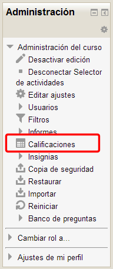
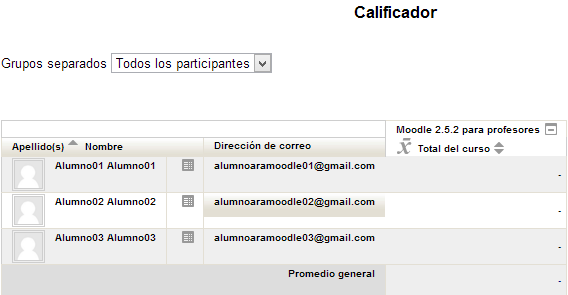
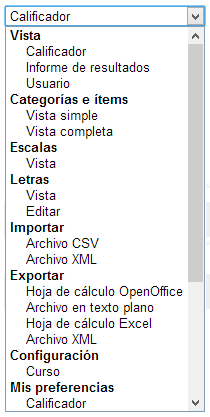
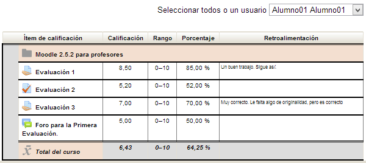
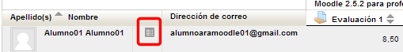

# U1. El libro de calificaciones

Todas las calificaciones obtenidas por los alumnos matriculados en un curso se recogen en el libro de calificaciones. Puedes acceder al calificador de varias formas.

La primera vez que accedes al calificador, una vez creado el curso, tendrás que hacerlo desde el **bloque de Administración**. Haciendo clic sobre el enlace a **Calificaciones ** que aparece dentro de este bloque:

**Fig. 6.1 Captura de pantalla. Bloque Administración.**

 

Al hacer clic sobre esta opción entrarás en el calificador general del curso, que en un principio aparecerá vacío si en el curso todavía no has creado ninguna tarea o actividad calificable.

Este será el aspecto que mostrará el calificador antes de incluir las actividades evaluables:

**Fig. 6.2 Captura de pantalla. Calificador**

 

Observa que aparecen tres columnas, la destinada a los alumnos/as, la que muestra el correo electrónico de los alumnos y la destinada a la calificación final del curso.

A medida que vayas creando las tareas, cuestionarios, o elementos calificables del curso éstos se irán integrando de forma automática en el calificador entre las columnas del correo electrónico y la de la calificación final del curso.

Cuando se califica la actividad de un estudiante, la calificación pasa automáticamente al libro.

En la parte superior del libro encontramos un menú desplegable que le permitirá acceder a los diferentes elementos implicados en el proceso de evaluación.

**Fig. 6.3. Captura de pantalla. Opciones del calificador.**

 

Si queremos ver las calificaciones de cada estudiante en detalle en ese menú seleccionamos **Vista-&gt;Usuario**. En la ventana que aparece podremos ir seleccionando un estudiante cada vez o verlos todos utilizando el menú desplegable Seleccionar todos o un usuario.

**Fig. 6.4 Captura de pantalla. Vista - Usuario**

 

Otro modo de obtener esta vista es hacer clic en el icono que hay junto al nombre del estudiante en el libro de calificaciones general.

**Fig. 6.5 Captura de pantalla. Calificador. Acceso a la vista usuario.**

 

Los estudiantes también pueden acceder a libro pero solo verán sus propias calificaciones.

 

## Tarea1

Accede al calificador de tu curso y familiarízate con su entorno. Si a lo largo de la lectura de los contenidos anteriores has creado tareas evaluables podrás verlas incluidas en tu calificador. 

Si es así, accede al calificador desde cualquiera de las tareas que has incluido en tu curso.

