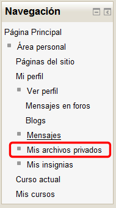
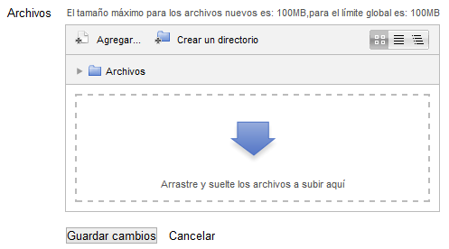
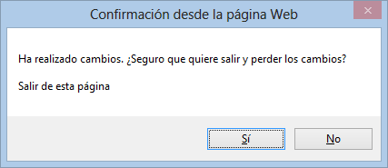

# U1. El sistema de archivos

Como disponemos ya de nuestra plataforma Moodle y hemos hecho una configuración concreta, ya sea por temas, semanas o cualquier otra, el paso siguiente es incorporar recursos para crear en ella un espacio educativo.

En esta versión de Moodle se ha producido un gran cambio en la gestión de archivos respecto a las versiones 1.x (anteriores a la 2). ahora los archivos se guardan en cada uno de los recursos o actividades del curso, de tal forma que los archivos asociados a una tarea sólo podrán verlo quienes tengas permiso para acceder a esa tarea.

Por otra parte, todos los usuarios disponen de una carpeta personal y privada con el nombre "Archivos privados" a la que se puede acceder desde "Mi perfil".

**Fig. 3.1 Captura de pantalla del bloque de navegación**

 

La gestión de los archivos se hace desde cada recurso o actividad. Se les añaden utilizando el Selector de Archivos, que es una ventana que aparecerá cada vez que tengamos que añadir y archivo. Además, nos proporciona la posibilidad de añadir los archivos con la técnica de "Arrastrar y soltar".

**Fig. 3.2 Captura de pantalla del selector de archivos**

  

## Importante

Antes de salir de esta página **debes pulsar en el botón "Guardar cambios..."**. De no hacerlo se perdería todo lo que has hecho en el selector de archivos.

Para prevenir esto, cuando intentas cambiar de página sin guardar los cambios, Moodle te avisa y pide confirmación: 

 

**Fig. 3.3 Captura de pantalla. Ventana de confirmación.**
