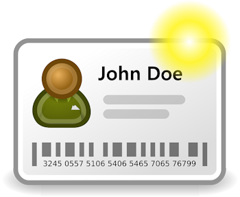

# U1. Matriculación

|**Fig. 4.2 Obtenida de [Pixabay](http://pixabay.com/en/contact-credit-card-id-97574/). Licencia CC0**

Cuando un alumno/a accede a la plataforma Moodle se encuentra con un listado de cursos. Cuando intenta acceder al curso correspondiente puede encontrarse con dos opciones:

** a) El alumno/a puede matricularse por si mismo**.    ** b) El alumno/a debe ser matriculado por el profesor/a.**

Vamos a ver que es lo que ocurre en cada uno de estos casos.
