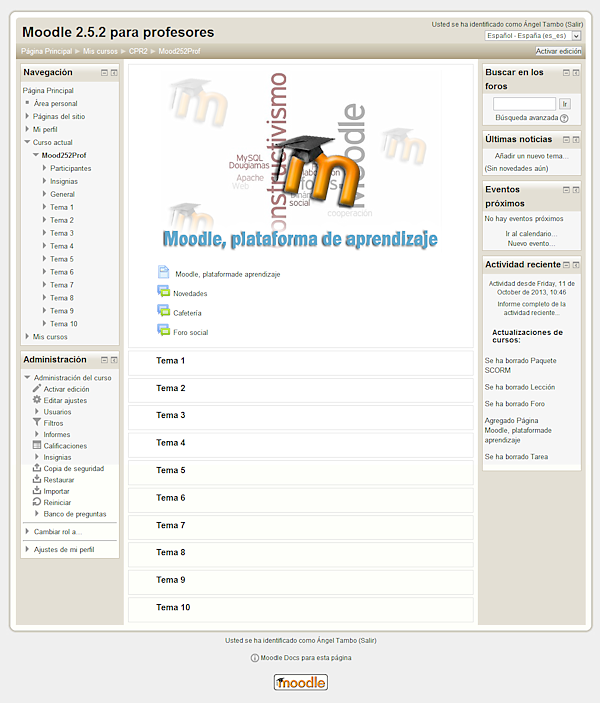

# U2. Añadiendo bloques

**Pero.... ¿dónde están los bloques? **

Cuando accedemos por primera vez al aula virtual de un curso de Moodle, independientemente del perfil que tengamos, se nos mostrará el aspecto y la configuración diseñada por los editores del mismo. En la imagen siguiente se muestra un posible diseño, que puede servirnos de ejemplo.

**Fig. 2.9. Captura de pantalla de un curso en Moodle**

## Pero......

### Pregunta

¿Cómo se accede al selector para crear los bloques?

#### Respuestas

<label class="sr-av" for="i47_5">[Opción 1](#answer-47_5)</label><input id="i47_5" name="option47_2" onclick="$exe.getFeedback(0,4,'47_2','multi')" type="radio"/>

No se ve porque la ventana está minimizada

<label class="sr-av" for="i47_83">[Opción 2](#answer-47_83)</label><input id="i47_83" name="option47_2" onclick="$exe.getFeedback(1,4,'47_2','multi')" type="radio"/>

Está oculto hasta que active la edición

<label class="sr-av" for="i47_86">[Opción 3](#answer-47_86)</label><input id="i47_86" name="option47_2" onclick="$exe.getFeedback(2,4,'47_2','multi')" type="radio"/>

Se ha desconfigurado Moodle y por eso no se puede acceder

<label class="sr-av" for="i47_89">[Opción 4](#answer-47_89)</label><input id="i47_89" name="option47_2" onclick="$exe.getFeedback(3,4,'47_2','multi')" type="radio"/>

Ninguna de las anteriores es correcta

#### Retroalimentación

Incorrecto

Opción correcta

Incorrecto

Incorrecto

#### Solución

1. [Incorrecto](#answer-47_5) ([Retroalimentación](#sa0b47_2))
1. [Opción correcta](#answer-47_83) ([Retroalimentación](#sa1b47_2))
1. [Incorrecto](#answer-47_86) ([Retroalimentación](#sa2b47_2))
1. [Incorrecto](#answer-47_89) ([Retroalimentación](#sa3b47_2))

Y ahora.... ¿notas alguna diferencia entre la primera imagen y la siguiente?

## Activa edición

Activa la edición en tu aula virtual Moodle y descubre dónde aparece la sección para añadir **Bloques.** Analiza qué opciones contiene el menú desplegable.

