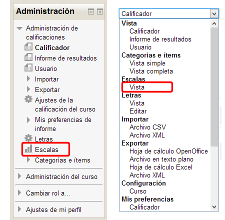
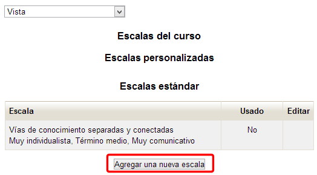
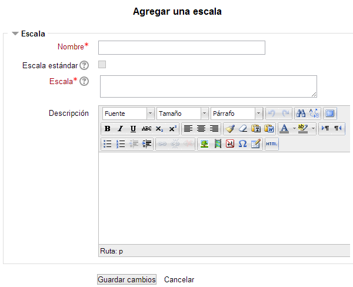
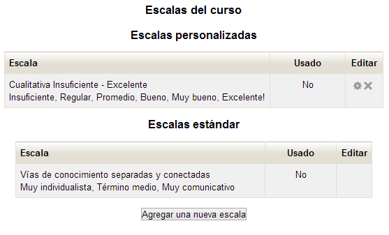
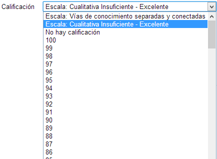

# U2. Escalas de calificación

Las puntuaciones de las actividades que se pueden evaluar pueden darse de forma numérica (con valores entre 1 y 100) o pueden usarse escalas cualitativas.

Vamos a ver cómo se crea una escala de calificación.

En el bloque **Administración** elegimos la opción **Calificaciones** para acceder al libro de calificaciones. En este mismo bloque de **Administración** (en este caso en la sección de **Ajustes de calificaciones**, elegimos la opción **Escalas**. También podemos aceder desde el desplegable que aparece en la parte superior del libro de calificaciones:

**Fig. 6.8 Captura de pantalla. Accesos a las escalas de calificación**

 

Obtendremos una pantalla similar a la siguiente:

**Fig. 6.9 Captura de pantalla. Escalas.**

 

Hay dos tipos de escalas:

- Las **escalas estándar**, que son definidas por el administrador de la plataforma y pueden usarse en todos los cursos que se creen en ella
- Las **escalas personalizadas**, que son definidas por los profesores con permisos de edición. Estas escalas pueden usarse únicamente en el curso para el que han sido creadas.

Para crear una escala debemos pulsar en el botón** Agregar una nueva escala**.

**Fig. 6.10 Captura de pantalla. Opciones de agregar escala.**

 

- **Nombre**: Aquí pondremos un nombre que describa la escala de manera que nos sea más sencillo identificarla. Este es el nombre que aparecerá en las listas de selección de escalas.
- **Escala estándar**: Está deshabiilitado puesto que hemos entrado a Moodle como profesor con permiso de edición. Sólo está disponible para el administrador del sistema y sirve para definir una escala como estándar.
- **Escala**: Aquí hay que poner los valores de la escala, **de menor a mayor**, **separados por comos**. Por ejemplo: Insuficiente, Regular, Promedio, Bueno, Muy bueno, Excelente!. Esto sería equivalente a una escla numérica de 1, 2, 3, 4, 5 y 6.
- **Descripción**: es el espacio para introducir un texto explicativo de lo que significan los valores de la escala y de cómo debería utilizarse. Aparecerá junto con el nombre en las páginas de ayuda para profesores y estudiantes.

Una vez que tenemos todo completo pulsamos el botón** Guardar cambios**

**Fig. 6.11 Captura de pantalla. Escalas.** 

 

A partir de entonces, cuando configuremos cualquier actividad podremos utilizar la escala creada en lugar de una numérica. Bastará con seleccionarla en el desplegable:

**Fig. 6.12 Captura de pantalla. Opciones de escala en actividades.**

 

 

## Tarea1

Define una escala personalizada. Después puedes aplicarla a alguna de las actividades que tienes diseñada en tu curso.

