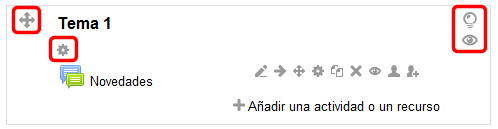
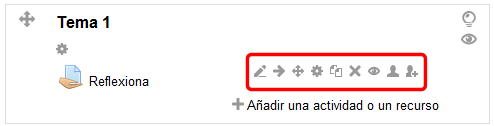
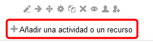
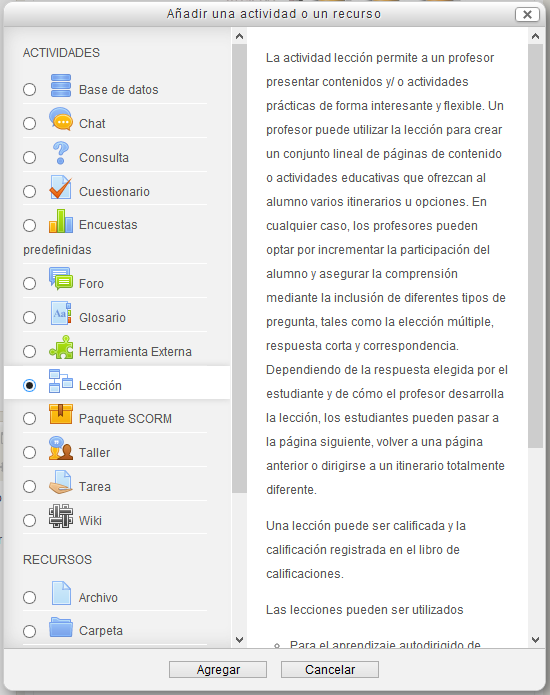

# U2. Los proveedores

Como eres un profesor con permiso de edición, puedes utilizar las herramientas de edición haciendo clic en Activar edición, en el bloque "Administración":

**Fig. 3.20 Captura de pantalla. Bloque Administración**

 

Puedes comprobar que la apariencia de la página cambia y que aparecen diversos iconos que representan distintas herramientas de edición y configuración:

**Fig. 3.21 Captura de pantalla . Parte de un curso con la edición activada**

 

Cada tema o módulo te ofrece varias opciones de configuración:

 

 Puedes verlo de modo más gráfico en el siguiente vídeo:

 

Del mismo modo, en cada actividad y en algunos recursos, puedes encontrar los siguientes iconos:

 

**Fig. 3.22 Captura de pantalla. Parte de un curso. Botones de edición de un recurso**

 

 

Además de estos iconos, vemos que aparece, bajo ellos el enlace "Añadir una actividad o recurso":

 

Pinchando en ella nos da acceso a una ventana con la lista de todos los tipos de actividades y recursos que podemos añadir a nuestro tema. Para cada uno de ellos nos da una explicación de en qué consiste.

**Fig. 3.23 Captura de pantalla. Ventana de elección de recurso o actividad**

 

## Actividad 1

 

Activa la edición de Moodle y experimenta con los diversos iconos de edición de los temas:

- Destaca un tema eligiendo la bombilla. Vuelve al estado anterior y deshaz la elección, volviendo a hacer clic en el icono de la bombilla. Prueba también a destacar un tema y luego otro. Observa lo que ocurre.
- Oculta un tema haciendo clic en el ojo y cerrándolo. Aunque tú lo veas de color gris, los alumnos no lo ven. Puede tener sus ventajas. Compruébalo cambiando tu rol tal y como lo muestra en el videotutorial.
- Mueve un tema hacia arriba o hacia abajo. Comprueba que se mueve con él todo su contenido, pero cambia el número de orden.
- Cambia el nombre a los temas poniendo uno que diga qué se va a trabajar en él.

Ten en cuenta que puedes hacer aquí un trabajo que te sirva para la evaluación final, así que haz ya cosas con sentido para poder aprovecharlas.
