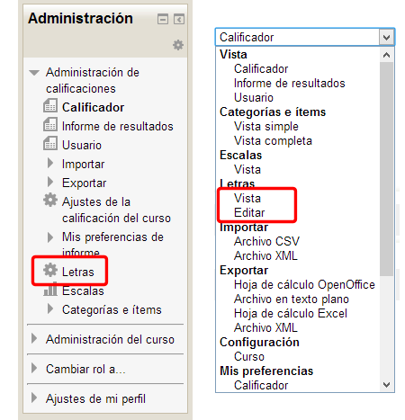
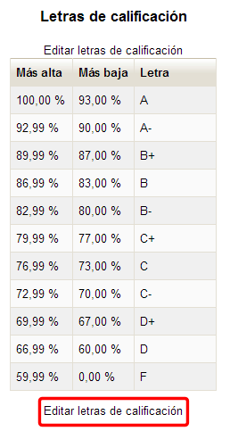
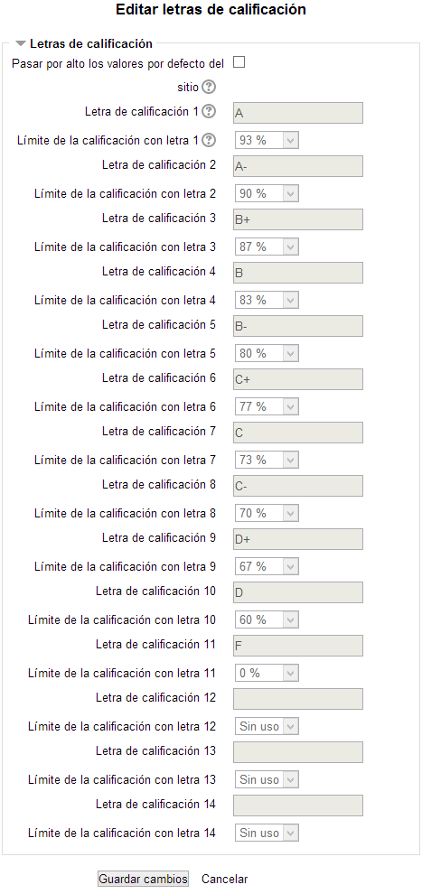
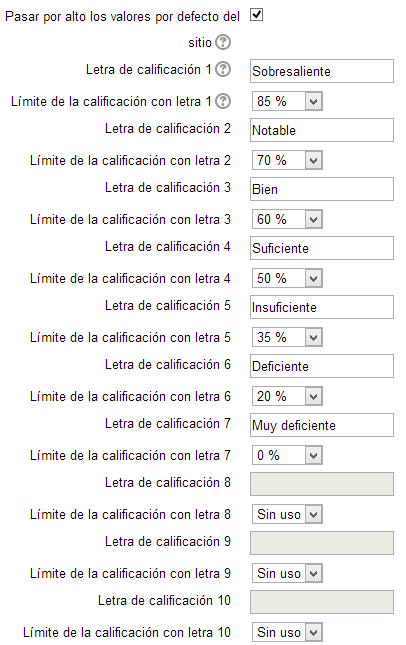
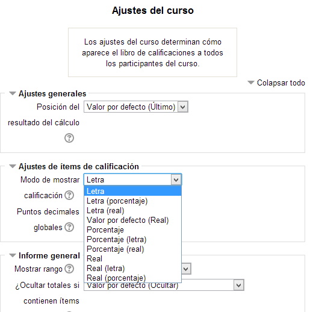
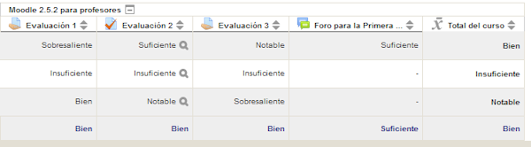

# U3. Calificación con letras

En Moodle es posible también utilizar letras como símbolos que representan un rango de calificaciones. Por ejemplo, la "A" puede usarse para representar calificaciones del 80% y superiores, la "B" para calificaciones entre 70 y 80%... Igualmente se podría poner la calificación de "Aprobado" para calificaciones que superan el 50% y "Suspendido" para calificaciones que no lo alcanzan.

Por defecto, en el curso hay unas letras para calificación ya definidas por defecto, pero puede modificarse fácilmente.

Para acceder a las Letras de calificación hay que entrar, como en el caso anterior, en el libro de calificaciones. Tendremos el acceso tanto el el bloque de Administración como en el desplegable de opciones del libro de calificaciones:

**Fig. 6.13 Captura de pantalla. Acceso a Letras.**

 

Haciéndolo accedemos a la Vista de las letras (aunque si en editable elegimos "Editar", entraremos directamente en la edición). Esta es la pantalla de vita de las letras de calificación:

**Fig. 6.14 Captura de pantalla. Letras de calificación**

 

Pulsando en el enlace **Editar letras de calificación** podremos acceder a la pantalla que nos permita modificarlas:

**Fig. 6.15 Captura de pantalla. Editar letras de calificación**

 

Nos encontramos con las clasificación ya hecha y sin posibilidad de editar. Para poder modificarlo tenemos que marcar la casilla de la primera opción "**Pasar por algo los valores por defecto del sitio**", de tal manera que en ese momento los campos de la lista de letras son editables.

Es tan sencillo como modificar los que nos interesen, tanto la "l**etra de calificación**", como el "**límite de la calificación**".

Si alguna de las letras ya diseñadas nos sobran, basta con que elijamos en su límite de calificación la opción "**Sin uso**".

Por último debemos pulsar en el botón **Guardar cambios**.

Nosotros hemos creado la siguiente relación de letras de calificación:

**Fig. 6.16 Captura de pantalla. Editar letras de calificación**

 

Para que las calificaciones aparezcan con las letras en lugar de únicamente la calificación numérica o la escala elegida, debemos acceder a la configuración del calificador (dese el desplegable "**Configuración-Curso**").

**Fig. 6.17 Captura de pantalla. Ajustes de items de calificación en los ajustes del curso**

 

Tras guardar los cambios veremos el calificador de la siguiente manera:

**Fig. 6.18 Captura de pantalla. Calificador**

## Tarea1

Crea tu propia lista de letras para el curso. Luego aplícala al curso y observa cómo cambian las calificaciones. Prueba a configurarlo para que presente:

- Letra
- Letra (porcentaje)
- Letra (real)

