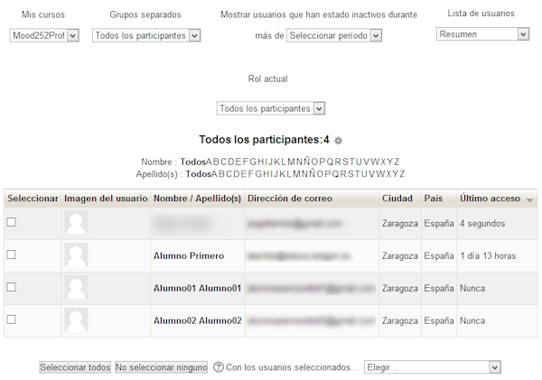

# U3. Panel de participantes

**Fig. 4.17 Captura de pantalla. Panel de participantes**

 

Como ya hemos visto, el panel de participantes es el que nos permite **gestionar** a todos los participantes que tenemos en un curso. Cuando son pocos, no hay ningún problema, pero si tenemos un número elevado de estudiantes, repartidos en grupos, hay algunas funciones que nos interesa conocer para **filtrar la información**.

Podemos considerar el panel dividido en tres zonas: **superior, listado e inferior**. Vamos a ver que encontramos en cada una de ellas.
