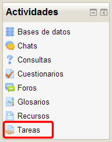
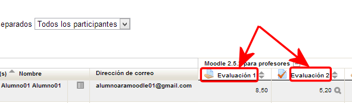
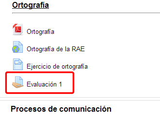
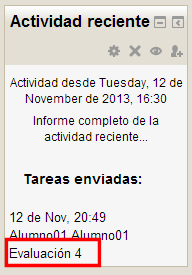
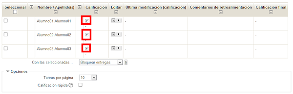
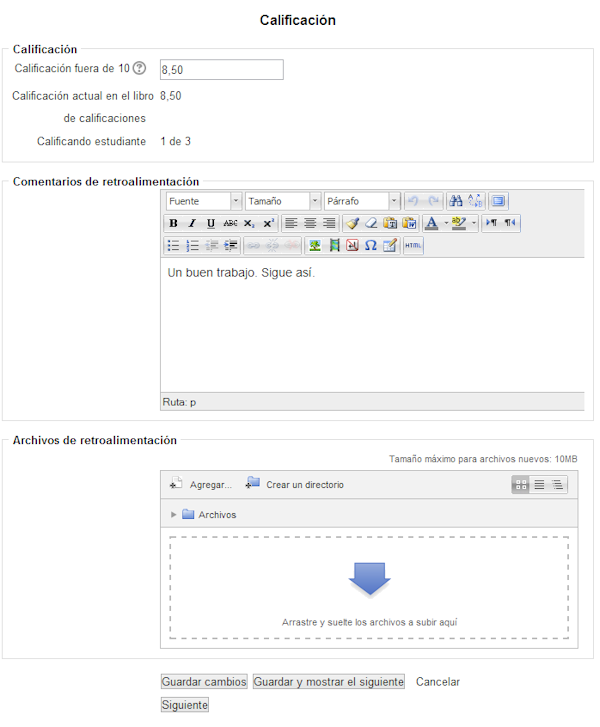

# U4. Calificar una actividad

Para proceder a la calificación de las tareas enviadas recuerda que deberás acceder al calificador de cada una de ellas.  Para hacerlo hay varias opciones:

- Desde el enlace Tareas que aparece en el bloque Actividades:

 

- Entrando, desde nuestro perfil de profesor, en la propia tarea
- Desde el calificador, haciendo clic sobre el nombre de la tarea que aparece en la columna correspondiente:

 

- Desde el propio flujo del curso, haciendo clic directamente sobre la tarea:

 

Entraremos en la descripción de la tarea, en la que habrá un enlace para **Ver/Calificar todas las tareas**

 

- Desde el bloque Actividad Reciente:

**Fig. 6.22 Captura de pantalla. Bloque Actividad reciente**

 

## Tarea1

Explora las distintas formas de acceder al calificador de tu curso.

En todo caso, entramos al calificador, que presenta este aspecto:

**Fig. 6.23 Captura de pantalla. Calificador**

 

Pinchando sobre el icono de acceso a la calificación pasamos a la calificación de la tarea para el alumno colrrespondiente:

**Fig. 6.24 Captura de pantalla. Calificación de una actividad**

 

Aquí, si lo hubiera podríamos descargar el archivo que el alumno haya subido como trabajo para evaluar. Podemos también ponerle una calificación.

También podremos ponerle la retroalimentación (porque así se ha definido en la tarea) tanto en forma de texto en el editor o con un archivo que le subamos.

Después no tenemos más que **Guardar los cambios**, para pasar al calificador general de la tarea o **Guardar y mostrar el siguiente** para calificar la tarea del siguiente alumno.

## Tarea1

Accede como alumno/a a tu curso y realiza cada una de las tareas que has propuesto en el curso.

## Tarea1

Accede al calificador de cada una de las tareas y observa las diferencias existentes entre cada una de ellas.

