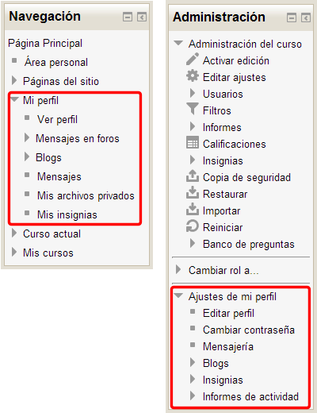
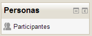

# U4. Perfil personal

El perfil personal es un elemento muy importante, tanto para el profesorado como para los usuarios y estudiantes de un curso. En el aparece la información personal que vamos a compartir con los demás usuarios del curso. Ahora veremos que podemos controlar la información que compartimos. Por defecto, parece recomendable que, cuanto más abierto este nuestro curso, (si permitimos por ejemplo el acceso a invitados) más cuidadosos seamos con la información que proporcionamos a otros usuarios. En el caso de que los estudiantes de nuestro curso sean **menores de edad**, debemos procurar que sean más cuidadosos todavía, pues podemos incluso encontrarnos con **problemas legales**. En este caso deberíamos probablemente contar con el **consentimiento familiar** para que los estudiantes puedan participar en el curso con todas sus consecuencias. Especialmente sensible será el tema de la **fotografía** y el de la **dirección de correo electrónico**.

### **Acceso al perfil personal**

Moodle permite acceder al perfil de los usuarios por múltiples caminos.

Los más visibles y accesibles están en el **panel de la izquierda de la página principal del curso**.

**Fig. 4.39 Captura de pantalla. Mi perfil y ajustes de mi perfil**

 

Si en el panel de ****Navegación** **desplegamos la opción **Mi perfil** y seleccionamos **Ver perfil**, accederemos directamente a nuestro perfil personal, en modo visualización. Si queremos modificarlo tendremos que ir al panel de ****Administración****. Desplegando la opción **Ajustes de mi perfil**, podremos seleccionar la opción **Editar perfil**. También podemos consultar el perfil de todos los usuarios del curso desde el panel ****Personas&gt;Participantes****, seleccionando a la persona de la que queramos conocer datos. También se puede ver el perfil de un usuario desde el panel de ****vista general grupos, calificaciones, informes, foros,...****

**Fig. 4.40 Captura de pantalla. Bloque Personas**

 

Lo importante es controlar la información que se ofrece en nuestro perfil y el de nuestros alumnos. Para ello debemos prestar un cuidado especial en la configuración del perfil de usuario.

 

 

## ¡ATENCIÓN!

## Reflexión

<input class="feedbackbutton" name="toggle-feedback-161_9" onclick="$exe.toggleFeedback(this,true);return false" type="button" value="Mostrar retroalimentación"/>

### Retroalimentación

## Actividad 8

Si no lo has hecho ya, **oculta  tu cuenta privada de correo electrónico**.
