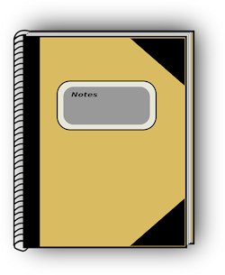
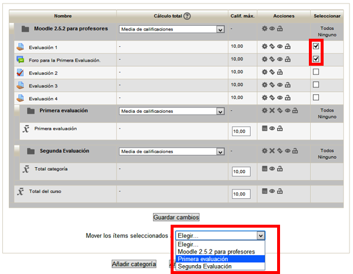
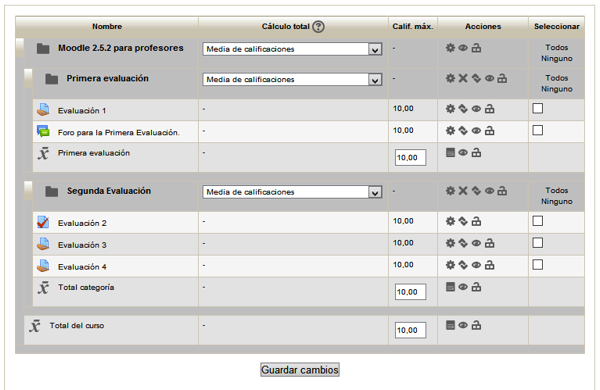

# U3. Categorías de calificación

**Fig. 6.31 Obtenida de [Pixabay](http://pixabay.com/en/school-notebook-education-note-34599/). Licencia CC0**</td>

## Crear y asignar categorías

A continuación vamos a ver cómo crear y asignar categorías en un curso. 

Para crear una categoría de calificación:

Entra a la "Configuración de calificaciones" 

Después hay que pulsar en "añadir categoría"

Se abre un menú para nombrar la categoría.

Se rellenan los campos. Hemos creado tres categorías, Trimestre 1, Trimestre 2 y Trimestre 3, para que los alumnos tengan calificación por separado de los tres.

Algunas de las opciones 
- **Nombre de categoría**: Para poner un nombre que la identifique en el libro de calificaciones.
- **Cálculo total**. Definimos aquí cómo se va a calcular la calificación de la categoría sobre la base de los elementos que la integran.
- **Tipo de calificación**. Valor, si se va a utilizar la calificación numérica. Escala, si se va a usar una escala cualitativa. Aunque en rigor no es necesario, para ser coherentes lo más sencillo es elegir el tipo de calificación que se haya aplicado en los elementos que vamos a integrar en la categoría.
- **Escala**. Si se ha seleccionado como tipo de calificación Escala, seleccionaremos aquí la escala a aplicar.
- **Calif. máxima y mínima**: Para definir qué rango de valores tendrá la calificación global de la categoría.
- **Ocultar**: Para ocultar a los alumnos las calificaciones de los items que pertenezcan a esta categoría.
- **Bloquear**: La calificación de los items que pertenezcan a esta categoría no podrán modificarse.

Hay más opciones ocultas que aparecerán pulsando en el correspondiente enlace "**Ver más...**" de cada uno de los bloques.

Si, al crear una nueva categoría, ya había otra u otras creadas antes, parecerá una nueva opción que permitirá convertirla directamente en subcategoría de una de las anteriores. Por defecto se crea como subcategoría de la categoría general del curso.

Después no tenemos más que pinchar en el botón **Guardar cambios**.

Las categoría creadas aparecerán vacías. Tendremos que incluir en ellas los items de evaluación que les correspondan:

**Fig. 6.35 Captura de pantalla. Categorías de calificación**

 

Para ello hemos marcado las que nos interesaban y, bajo la lista de items hemos elegido en el desplegable la categoría en la que queremos incluirlos. Repetimos el proceso con todos los items que queremos incluir en una categoría. Así quedaría nuestro curso tras la creación de dos categorías:

**Fig. 6.36 Captura de pantalla. Categorías de calificación**

